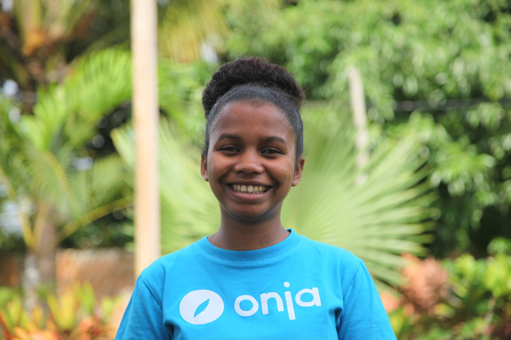

# Berthia Rasoanirina
Wave2.1 student
## About me
I am from a small village called *Kelilalina*. But I am living in **Toamasina** because of my study.  
It has been **13 months** since I joined Onja. I was A1 at that time. But now, we have just finished our English courses, and has just started our *coding course*. 

## Interest
- Watching supernatural movies
- Listening [Jamie Miller's songs](https://www.youtube.com/watch?v=aFj-v80o4bc)
- Cooking
- Singing
- Dancing

## Background
1. CEPE: 2016
2. BEPC: 2020
3. Baccalaureate serie S: 2023
4. Baccalaureate serie D: 2024
5. English level: B2-C1

## My quote
> Berthia Rasoanirina, TEDx, February 2026 titled **Hazel eyes** : 
>>*"Celebrate the part of yourself that is hard to define."*

\# Just practice!kkkkkk